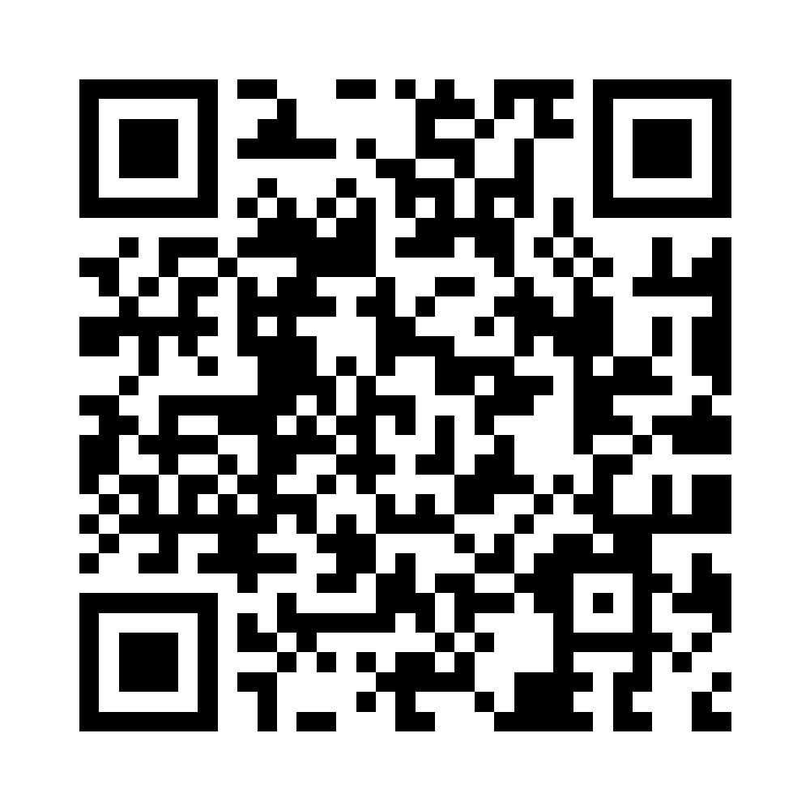

# Gain Gain — App Download QR Code

One QR code that sends users to the right app store automatically.

## How it works

The QR code encodes **https://gaingain-app.github.io/** — the page in this repo
(`index.html`). When scanned, the page detects the device and redirects:

| Device | Goes to |
|---|---|
| Android | [Gain Gain on Google Play](https://play.google.com/store/apps/details?id=com.gaingain) |
| iPhone / iPad | [Gain Gain on the App Store](https://apps.apple.com/sg/app/gain-gain/id6738471119) |
| Desktop / other | Google Play (fallback) |

## Updating the store links

Edit the two URLs at the top of `index.html` and push. The printed QR code
never changes — it always points to this page, so links can be updated any
time without reprinting.

**Do not rename or delete this repo** — the repo name (`gaingain-app.github.io`)
is what keeps the page live at the root URL. Deleting it breaks every printed
QR code.

## Files

- `index.html` — the device-detecting redirect page (GitHub Pages serves this)
- `gaingain-qr.png` — the QR code, 1000×1000 px, error correction level H
- `test-redirect.mjs` — tests for the redirect logic; run with `node test-redirect.mjs`
